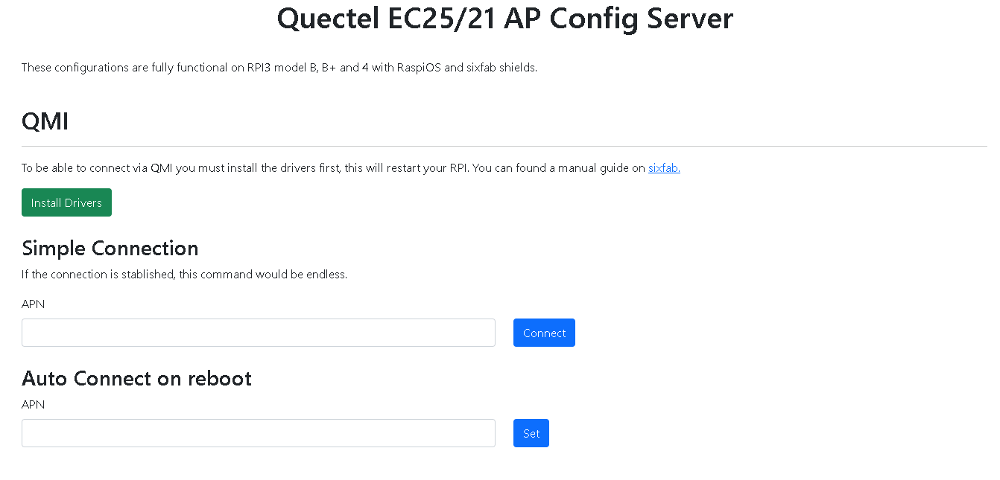

# Quectel EC25/21 AP Config Server

With this server you can access remotely to your RPI3/4 and connect to internet via QMI with an APN. Compatible with EC25 and EC21.

## Captures

## TODO

- [ ] Add Error handling

- [ ] Dynamic output console

- [ ] Add Internet connection via ECM Mode support

- [ ] Save configurations (apn used)
